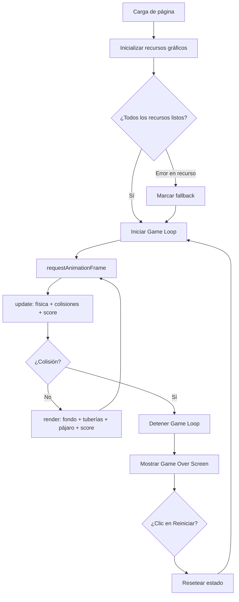
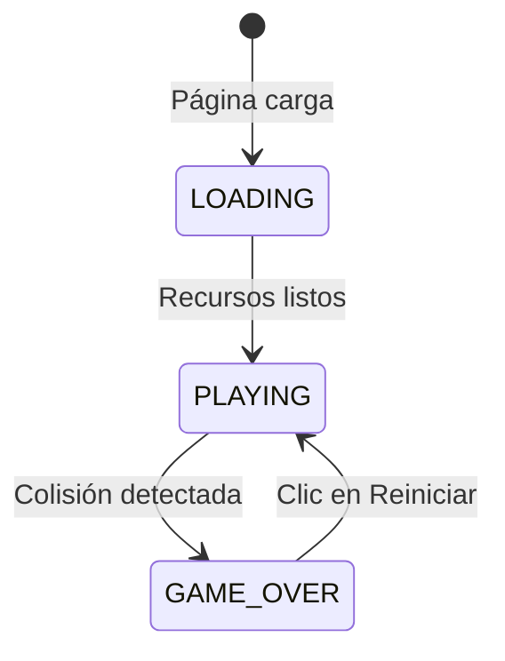

# Design Document: Flappy Bird Game

## Overview

El juego Flappy Bird es una aplicación web de un solo archivo (`index.html`) que implementa el clásico juego de arcade usando HTML5 Canvas y JavaScript puro. El jugador controla un pájaro que vuela horizontalmente y debe esquivar tuberías verdes generadas proceduralmente. La física se basa en gravedad constante y un impulso hacia arriba al presionar la barra espaciadora.

### Decisiones de diseño clave

- **Un solo archivo HTML**: Todo el código (HTML, CSS, JS) reside en `index.html` para máxima portabilidad. Las imágenes se referencian con rutas relativas.
- **HTML5 Canvas 2D**: Se usa `<canvas>` con la API `CanvasRenderingContext2D` para renderizado de alto rendimiento sin dependencias externas.
- **Game Loop con `requestAnimationFrame`**: Garantiza sincronización con el refresco del monitor y permite pausar automáticamente cuando la pestaña no está visible.
- **Fondo GIF animado**: Se renderiza un elemento `` con un GIF como fondo del canvas usando `drawImage`, lo que permite animación sin lógica adicional en JS.
- **Fallback visual**: Si algún recurso no carga, se usa un rectángulo de color sólido para no bloquear el juego.

---

## Architecture

El juego sigue una arquitectura de **Game Loop clásico** con separación de responsabilidades en módulos lógicos dentro de un único archivo JS embebido.



### Estados del juego



---

## Components and Interfaces

### 1. `ResourceLoader`

Responsable de cargar todas las imágenes antes de iniciar el juego.

```javascript
// Interfaz conceptual
ResourceLoader = {
  birdImage: HTMLImageElement,       // pajaro.png
  pipeImage: HTMLImageElement,       // tuvo verde.png
  bgImage: HTMLImageElement,         // fondo.gif (GIF animado)
  birdReady: boolean,
  pipeReady: boolean,
  bgReady: boolean,
  load(onAllReady: Function): void   // Carga en paralelo, llama callback cuando todos listos
}
```

**Estrategia de carga**: Se crean tres objetos `Image`, se asignan `onload` y `onerror`. Un contador interno lleva la cuenta de cuántos han terminado (con éxito o error). Cuando el contador llega a 3, se invoca `onAllReady`.

---

### 2. `Bird`

Representa al pájaro controlado por el jugador.

```javascript
Bird = {
  x: number,          // Posición horizontal fija (80 px desde el borde izquierdo)
  y: number,          // Posición vertical actual (centro del canvas al inicio)
  width: number,      // 40 px
  height: number,     // 30 px
  velocityY: number,  // Velocidad vertical actual (px/frame)
  flap(): void,       // Establece velocityY = -8
  update(): void,     // Aplica gravedad: velocityY += 0.5, clamp a 10; y += velocityY
  getBoundingBox(): {x, y, width, height}  // Retorna el bounding box actual
}
```

---

### 3. `PipeManager`

Gestiona la generación, movimiento y eliminación de tuberías.

```javascript
PipeManager = {
  pipes: Array<PipePair>,   // Lista de pares activos
  spawnInterval: number,    // 1500 ms
  pipeSpeed: number,        // 3 px/frame
  pipeWidth: number,        // 60 px
  gapSize: number,          // 150 px
  lastSpawnTime: number,    // Timestamp del último spawn
  update(timestamp: number): void,  // Genera nuevas tuberías, mueve y elimina las que salen
  reset(): void             // Vacía la lista de tuberías
}

PipePair = {
  x: number,          // Posición horizontal del par
  gapY: number,       // Centro del gap (posición Y aleatoria entre 100 y canvasH-100)
  scored: boolean     // Flag para evitar doble conteo del score
}
```

Cada `PipePair` genera dos segmentos:
- **Tubería superior**: `y = 0`, `height = gapY - gapSize/2`
- **Tubería inferior**: `y = gapY + gapSize/2`, `height = canvasHeight - (gapY + gapSize/2)`

---

### 4. `ScoreManager`

Gestiona la puntuación.

```javascript
ScoreManager = {
  score: number,
  increment(): void,   // score += 1
  reset(): void,       // score = 0
  get(): number        // Retorna score actual
}
```

---

### 5. `CollisionDetector`

Detecta colisiones usando AABB (Axis-Aligned Bounding Box).

```javascript
CollisionDetector = {
  // Retorna true si los dos rectángulos se superponen
  checkAABB(a: BoundingBox, b: BoundingBox): boolean,
  
  // Verifica colisión del pájaro con todos los pipes y con los bordes del canvas
  check(bird: Bird, pipes: PipePair[], canvasHeight: number): boolean
}
```

---

### 6. `Renderer`

Responsable de dibujar todos los elementos en el canvas en cada frame.

```javascript
Renderer = {
  ctx: CanvasRenderingContext2D,
  canvas: HTMLCanvasElement,
  drawBackground(bgImage, bgReady): void,
  drawBird(bird, birdImage, birdReady): void,
  drawPipes(pipes, pipeImage, pipeReady, pipeWidth, gapSize): void,
  drawScore(score): void,
  drawGameOver(score): void,
  clearGameOver(): void
}
```

---

### 7. `GameController`

Orquesta todos los componentes. Contiene el Game Loop principal.

```javascript
GameController = {
  state: 'LOADING' | 'PLAYING' | 'GAME_OVER',
  animationFrameId: number,
  lastTimestamp: number,
  
  init(): void,          // Carga recursos, configura listeners
  startGame(): void,     // Resetea estado, inicia loop
  gameLoop(timestamp): void,  // update + collision check + render
  handleGameOver(): void,
  handleInput(event: KeyboardEvent): void,
  handleRestart(): void
}
```

---

## Data Models

### BoundingBox

```javascript
{
  x: number,       // Coordenada X del borde izquierdo
  y: number,       // Coordenada Y del borde superior
  width: number,   // Ancho en píxeles
  height: number   // Alto en píxeles
}
```

### PipePair

```javascript
{
  x: number,        // Posición X del borde izquierdo de la tubería
  gapY: number,     // Centro vertical del gap (entre 100 y canvasHeight-100)
  scored: boolean   // true si el pájaro ya pasó este par (evita doble conteo)
}
```

### GameState

```javascript
{
  state: 'LOADING' | 'PLAYING' | 'GAME_OVER',
  score: number,
  bird: {
    x: number,
    y: number,
    velocityY: number
  },
  pipes: PipePair[],
  lastPipeSpawn: number  // DOMHighResTimeStamp del último spawn
}
```

### Constantes del juego

```javascript
const CANVAS_WIDTH  = 480;   // px
const CANVAS_HEIGHT = 640;   // px
const BIRD_X        = 80;    // px (posición horizontal fija)
const BIRD_WIDTH    = 40;    // px
const BIRD_HEIGHT   = 30;    // px
const GRAVITY       = 0.5;   // px/frame²
const FLAP_VELOCITY = -8;    // px/frame
const MAX_FALL_SPEED = 10;   // px/frame (velocidad terminal)
const PIPE_WIDTH    = 60;    // px
const PIPE_GAP      = 150;   // px
const PIPE_SPEED    = 3;     // px/frame
const PIPE_INTERVAL = 1500;  // ms entre spawns
const GAP_MIN_Y     = 100;   // px desde el borde superior
```

---

## Correctness Properties

*Una propiedad es una característica o comportamiento que debe mantenerse verdadero en todas las ejecuciones válidas del sistema — esencialmente, una declaración formal sobre lo que el sistema debe hacer. Las propiedades sirven como puente entre las especificaciones legibles por humanos y las garantías de corrección verificables por máquina.*

### Property 1: Gravedad incrementa velocidad vertical

*Para cualquier* estado del pájaro con velocidad vertical menor a la velocidad terminal (10 px/frame), después de aplicar `update()`, la velocidad vertical debe ser exactamente `velocityY_anterior + 0.5`, y nunca superar 10 px/frame.

**Validates: Requirements 2.1**

---

### Property 2: Flap establece velocidad negativa

*Para cualquier* estado del pájaro (independientemente de su velocidad vertical actual), después de ejecutar `flap()`, la velocidad vertical debe ser exactamente −8 px/frame.

**Validates: Requirements 2.2**

---

### Property 3: El gap siempre es transitable

*Para cualquier* par de tuberías generado, el espacio entre el segmento superior y el inferior debe ser exactamente 150 px, y el centro del gap debe estar entre 100 px y (canvasHeight − 100) px, garantizando que el gap nunca quede fuera de los límites del canvas.

**Validates: Requirements 3.2**

---

### Property 4: Detección de colisión AABB es correcta

*Para cualquier* par de bounding boxes, `checkAABB` debe retornar `true` si y solo si los rectángulos se superponen (incluyendo el caso de contacto en un borde), y `false` en caso contrario.

**Validates: Requirements 4.1, 4.3**

---

### Property 5: El score no se cuenta dos veces

*Para cualquier* par de tuberías que el pájaro supera, el score debe incrementarse exactamente en 1 punto, sin importar cuántos frames el pájaro permanezca a la derecha de esa tubería.

**Validates: Requirements 5.1**

---

### Property 6: Reset del juego restaura el estado inicial

*Para cualquier* estado del juego (incluyendo score alto, muchas tuberías activas, posición arbitraria del pájaro), después de ejecutar `handleRestart()`, el estado debe ser equivalente al estado inicial: score = 0, lista de tuberías vacía, pájaro en el centro vertical del canvas, velocidad vertical = 0.

**Validates: Requirements 5.3, 6.5**

---

## Error Handling

### Recursos gráficos no disponibles

Cada imagen (`pajaro.png`, `tuvo verde.png`, GIF de fondo) tiene un handler `onerror` que:
1. Marca el recurso como no disponible (`birdReady = false`, etc.)
2. Registra un mensaje en `console.warn` para diagnóstico
3. Permite que el juego continúe usando fallbacks visuales:
   - **Pájaro**: Rectángulo amarillo (40×30 px)
   - **Tubería**: Rectángulo verde (`#2ecc71`, 60 px de ancho)
   - **Fondo**: Rectángulo azul cielo (`#87CEEB`) cubriendo todo el canvas

### Colisión con bordes del canvas

- **Borde superior** (`bird.y ≤ 0`): Se registra colisión y se activa Game Over.
- **Borde inferior** (`bird.y + bird.height ≥ canvasHeight`): Ídem.

### Entrada de teclado en estado incorrecto

- Si el estado es `GAME_OVER` o `LOADING`, los eventos de teclado se ignoran silenciosamente.

### Game Loop y `requestAnimationFrame`

- El ID del frame se almacena en `animationFrameId`. Al activar Game Over, se llama `cancelAnimationFrame(animationFrameId)` para detener el loop limpiamente.
- En el reinicio, se cancela cualquier frame pendiente antes de iniciar uno nuevo.

---

## Testing Strategy

### Enfoque dual: tests unitarios + tests de propiedades

El juego usa JavaScript puro sin framework de testing integrado. Se recomienda usar **[fast-check](https://fast-check.io/)** para property-based testing y **Jest** o **Vitest** para tests unitarios, ejecutados en un entorno Node.js separado del archivo `index.html`.

La lógica de juego (física, colisiones, score, generación de tuberías) debe estar extraída en funciones puras para facilitar el testing sin necesidad de un DOM real.

---

### Tests unitarios (ejemplo-based)

| Componente | Caso de prueba |
|---|---|
| `Bird.flap()` | Velocidad queda en −8 independientemente del valor previo |
| `Bird.update()` | Velocidad no supera 10 px/frame (velocidad terminal) |
| `CollisionDetector.checkAABB` | Dos rectángulos que se tocan en un borde → `true` |
| `CollisionDetector.checkAABB` | Dos rectángulos separados → `false` |
| `PipeManager` | El primer par se genera al inicio de la partida |
| `ScoreManager` | Score se incrementa en 1 al pasar una tubería |
| `ScoreManager.reset()` | Score vuelve a 0 |
| `GameController.handleRestart()` | Estado completo vuelve a valores iniciales |
| Fallback visual | Si `birdReady = false`, se dibuja rectángulo amarillo |

---

### Tests de propiedades (property-based con fast-check)

Cada test de propiedad debe ejecutarse con **mínimo 100 iteraciones**.

#### Property 1: Gravedad incrementa velocidad vertical

```javascript
// Feature: flappy-bird-game, Property 1: Gravedad incrementa velocidad vertical
fc.assert(fc.property(
  fc.float({ min: -8, max: 9.4 }),  // velocityY inicial < velocidad terminal
  (initialVelocity) => {
    const bird = createBird({ velocityY: initialVelocity });
    bird.update();
    return bird.velocityY === Math.min(initialVelocity + 0.5, MAX_FALL_SPEED);
  }
), { numRuns: 100 });
```

#### Property 2: Flap establece velocidad negativa

```javascript
// Feature: flappy-bird-game, Property 2: Flap establece velocidad negativa
fc.assert(fc.property(
  fc.float({ min: -20, max: 20 }),  // cualquier velocidad previa
  (initialVelocity) => {
    const bird = createBird({ velocityY: initialVelocity });
    bird.flap();
    return bird.velocityY === FLAP_VELOCITY; // -8
  }
), { numRuns: 100 });
```

#### Property 3: El gap siempre es transitable

```javascript
// Feature: flappy-bird-game, Property 3: El gap siempre es transitable
fc.assert(fc.property(
  fc.integer({ min: 200, max: 1000 }),  // canvasHeight variable
  (canvasHeight) => {
    const pipe = generatePipePair(canvasHeight);
    const topPipeBottom = pipe.gapY - PIPE_GAP / 2;
    const bottomPipeTop = pipe.gapY + PIPE_GAP / 2;
    const gapSize = bottomPipeTop - topPipeBottom;
    return (
      gapSize === PIPE_GAP &&
      pipe.gapY >= GAP_MIN_Y &&
      pipe.gapY <= canvasHeight - GAP_MIN_Y
    );
  }
), { numRuns: 100 });
```

#### Property 4: Detección de colisión AABB es correcta

```javascript
// Feature: flappy-bird-game, Property 4: Detección de colisión AABB es correcta
const boxArb = fc.record({
  x: fc.integer({ min: 0, max: 400 }),
  y: fc.integer({ min: 0, max: 600 }),
  width: fc.integer({ min: 1, max: 100 }),
  height: fc.integer({ min: 1, max: 100 })
});
fc.assert(fc.property(boxArb, boxArb, (a, b) => {
  const overlaps = checkAABB(a, b);
  const actualOverlap =
    a.x < b.x + b.width &&
    a.x + a.width > b.x &&
    a.y < b.y + b.height &&
    a.y + a.height > b.y;
  return overlaps === actualOverlap;
}), { numRuns: 100 });
```

#### Property 5: El score no se cuenta dos veces

```javascript
// Feature: flappy-bird-game, Property 5: El score no se cuenta dos veces
fc.assert(fc.property(
  fc.integer({ min: 1, max: 20 }),  // número de frames que el pájaro permanece a la derecha
  (framesAfterPassing) => {
    const state = createGameState();
    const pipe = createPipePair({ x: BIRD_X - PIPE_WIDTH - 1 }); // ya pasado
    state.pipes = [pipe];
    let scoreIncrements = 0;
    for (let i = 0; i < framesAfterPassing; i++) {
      const prevScore = state.score;
      updateScore(state);
      if (state.score > prevScore) scoreIncrements++;
    }
    return scoreIncrements === 1;
  }
), { numRuns: 100 });
```

#### Property 6: Reset del juego restaura el estado inicial

```javascript
// Feature: flappy-bird-game, Property 6: Reset del juego restaura el estado inicial
fc.assert(fc.property(
  fc.integer({ min: 0, max: 999 }),   // score arbitrario
  fc.integer({ min: 0, max: 20 }),    // número de tuberías activas
  fc.float({ min: -8, max: 10 }),     // velocidad vertical del pájaro
  (score, pipeCount, birdVelocity) => {
    const state = createArbitraryGameState({ score, pipeCount, birdVelocity });
    resetGame(state, CANVAS_HEIGHT);
    return (
      state.score === 0 &&
      state.pipes.length === 0 &&
      state.bird.y === CANVAS_HEIGHT / 2 &&
      state.bird.velocityY === 0
    );
  }
), { numRuns: 100 });
```

---

### Cobertura objetivo

- Lógica de física del pájaro: 100%
- Detección de colisiones AABB: 100%
- Generación de tuberías (posición del gap): 100%
- Sistema de puntuación (sin doble conteo): 100%
- Reset del estado del juego: 100%
- Renderizado y fallbacks visuales: tests manuales / visuales
