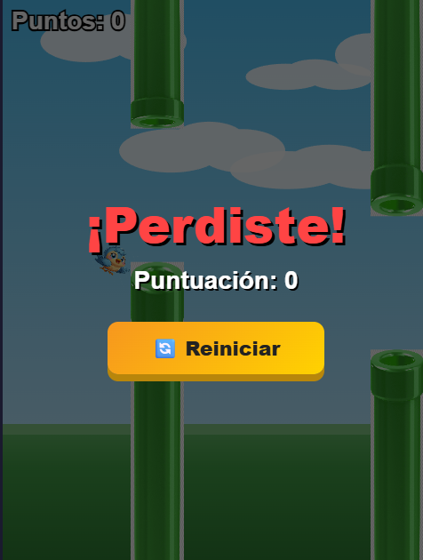
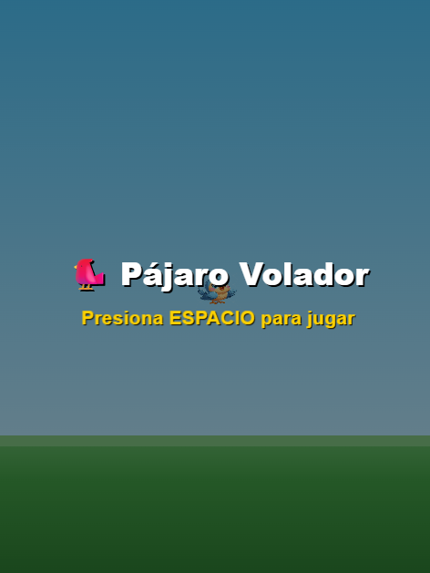
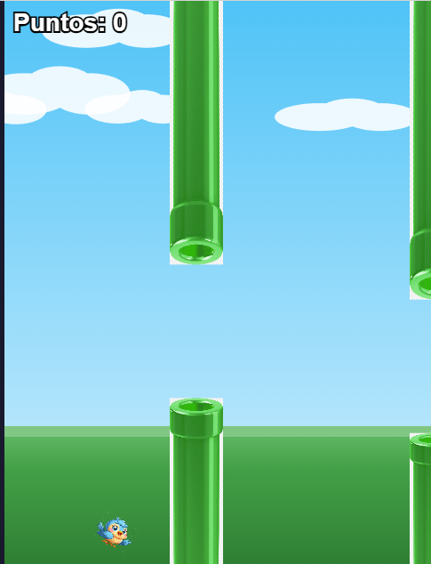
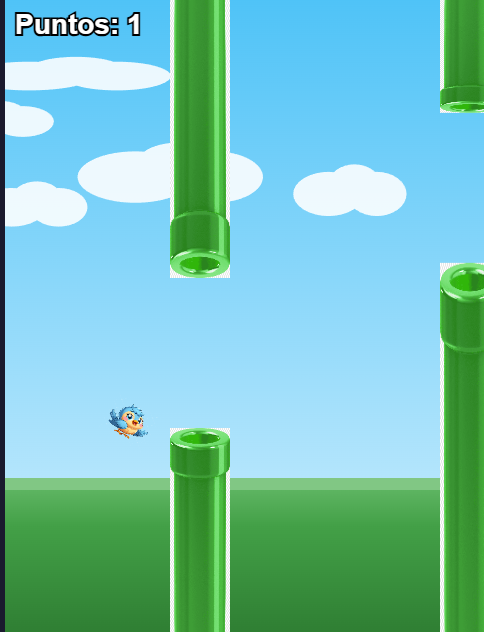

# 🐦 Pájaro Volador

Un juego estilo Flappy Bird hecho con HTML5 Canvas y JavaScript puro. Controla un pájaro que debe esquivar tuberías verdes presionando la barra espaciadora.

---

## 🎮 Cómo jugar

- **Barra espaciadora** o **clic** → el pájaro sube
- Esquiva las tuberías verdes
- Cada par de tuberías superado suma **1 punto**
- Si tocas una tubería o los bordes, aparece la pantalla de **"¡Perdiste!"**
- Presiona **Reiniciar** para volver a jugar

---

## 📸 Capturas del juego

### Pantalla de inicio

### Jugando

### Esquivando tuberías

### Pantalla de Game Over

---

## 🚀 Cómo ejecutar

1. Asegúrate de tener estos archivos en la misma carpeta:
   - `index.html`
   - `pajaro.png`
   - `tuvo verde.png`

2. Abre `index.html` directamente en tu navegador (Chrome, Firefox o Edge).

¡No necesitas instalar nada!

---

## ⚙️ Detalles técnicos

| Parámetro | Valor |
|---|---|
| Gravedad | 0.5 px/frame² |
| Velocidad de salto | −8 px/frame |
| Velocidad terminal | 10 px/frame |
| Velocidad tuberías | 3 px/frame |
| Intervalo tuberías | 1500 ms |
| Hueco entre tuberías | 150 px |

---

## 🛠️ Tecnologías

- HTML5
- CSS3
- JavaScript puro (sin frameworks)
- Canvas API
